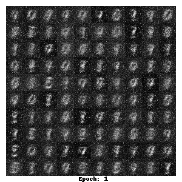

# Generative Adversarial Networks

arXiv:1406.2661

## References

- [Generative Adversarial Networks](https://proceedings.neurips.cc/paper/2014/file/5ca3e9b122f61f8f06494c97b1afccf3-Paper.pdf)

## Characteristics

- Generative Model은 Random Noise를 mutilayer perceptron에 통과시켜 샘플을 생성하고, Discriminative Model도 multilayer perceptron으로 구성함으로써 Markov Chain이나 근사적인 추론 없이 dropout 과 back propagation만으로 학습하고 front propagation을 통해 샘플 생성이 가능하도록 한다.

## Approach

기존의 딥러닝 기반 생성 모델은 확률론적 계산 과정의 근사를 다루기 어렵고 딥러닝 모델의 선형 연산이 결과물 생성에 큰 이점이 되지 못했기 때문에 주목받지 못했음. GAN에서는 훈련 데이터와 유사한 생성물을 생성해내 D를 속이는 것을 목적으로 하는 Generatative Model G 와 주어진 샘플이 훈련 데이터에 속하는지 G가 생성한 결과물에 속하는지를 구분해내는 Discriminative Model D 간의 적대적 minimax game을 통해 훈련이 진행됨. 훈련이 계속 진행되면 결론적으로 G는 훈련 데이터에 수렴하고, D는 모든 상황에서 예측 확률이 1/2에 수렴함.

## Model

1. 노이즈 $p_{z}(z)$
2. Generator $G(z; \theta_{g})$ 는 multilayer perception으로 입력된 노이즈를 기반으로 샘플 생성
3. Discriminator $D(x; \theta_{d})$ 는 multilayer perception으로 입력된 샘플이 훈련 데이터에 속하는지 생성된 G에 의해 생성된 데이터인지 판단 ( x 가 생성된 것이 아닌 훈련 데이터일 확률 D(x) 계산)
4. D는 $log D(x)$ 를 최대화 시키도록, G는 $log (1 - D (G(z)))$ 를 최소화시키기 위해 훈련

결론적으로 D 와 G는 다음 value function에 대한 minimax game을 진행

5. D의 과적합을 방지하기 위해 D를 k번 학습, G를 1번 학습시키는 과정을 반복시킴으로써 D를 최적해 부근에서 유지시키며 천천히 G를 훈련시킴.

6. 학습 초반에는 D가 G가 생성한 결과물을 매우 쉽게 구분해 내기 때문에 G가 학습할 gradient가 약하므로 $log (D(G(z)))$ 를 최대화시키는 방법으로 학습함.

## Training Process

다음과 같은 과정으로 훈련이 이루어진다. 알고리즘과 수식적인 증명은 논문 참고.

그림에서 검은 점선은 진짜 데이터의 분포, 초록색 실선은 Generator가 생성한 가짜 데이터의 분포, 파란색 점선은 Discriminator의 분포를 나타낸다. 밑의 선은 Genrator에 의해 노이즈 z의 생성된 가짜 데이터 x 로의 mapping을 설명한다.

1. (a)를 살펴보면 진짜 데이터와 G가 생성한 데이터의 분포 사이에 거리가 있으며, D의 성능도 좋지 못하다.
2. 이 상황에서 D만 학습시키면 (b)에서 보듯이 D는 가짜 데이터와 진짜 데이터를 구분할 수 있게 된다.
3. 이번에는 D의 학습을 중지시키고 이를 이용해 G를 학습시키면 (c)와 같이 G가 생성하는 가짜 데이터는 점점 진짜 데이터와 유사해진다.
4. 위 두 과정을 계속 반복하게 되면 G가 생성하는 데이터의 분포는 진짜 데이터에 수렴하게 되고 D는 진짜 데이터와 가짜 데이터를 구분할 수 없는 상태가 되어 구분 성공률이 1/2의 일정한 값에 수렴하게 된다.

## Implementation

Environment: Pytorch / Apple M1 Pro (10 Core CPU, 16 Core GPU, 16GB RAM)
Training Time: 18min 50s (50 Epochs, k=10, batch size=64)

**Training Result**

[Generated Image Per Epoch](https://github.com/kunheekimkr/study_ML/tree/main/VanillaGAN/result)

To-do: 훈련 한번 더 진행시키면서 Loss Graph 그리기
