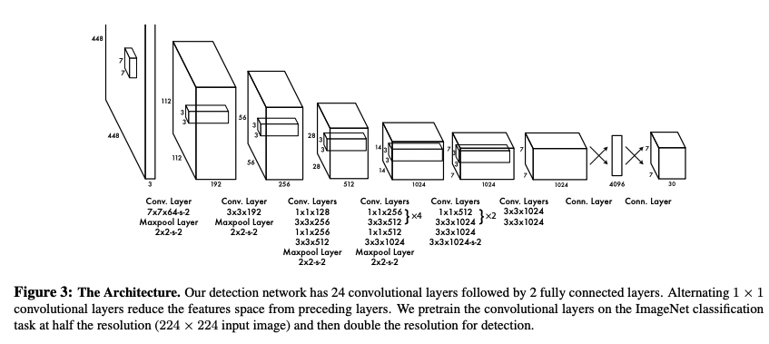
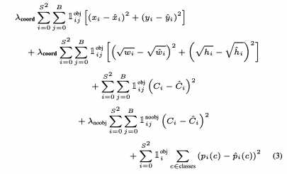
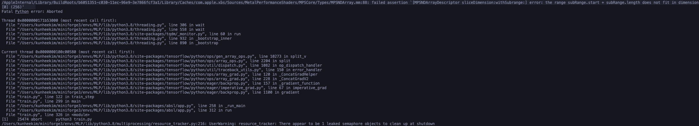

# You Only Look Once : Unified, Real-Time Object Detection

arXiv:1506.02640

## References

- [You Only Look Once: Unified, Real-Time Object Detection](https://arxiv.org/abs/1506.02640)

## Characteristics

- 단일 신경만 구조로 구성이 단순하고 빠름
- 이미지를 전체적으로 학습하기 때문에 배경을 물체로 인식하는 background-error가 적음
- 일반화 성능이 뛰어나 artwork등 특수한 이미지에 대해서도 인식률이 뛰어남
- SOTA 모델에 비해 정확도가 떨어지나 Real-Time 급 속도에서 장점을 가짐

## Approach

기존의 Detection Model은 사진의 다양한 위치를 다양한 크기로 잘라 Image Classificatior를 적용시켜 Object Detection의 목적을 달성했지만, YOLO의 경우 이미지 픽셀로부터 Bounding Box Coordinate(물체의 위치)와 Class Probability(물체의 종류)를 계산하는 하나의 회귀 문제로 재구성하는 새로운 접근.

1. 이미지를 448 x 448로 크기 변환
2. CNN 모델을 통해 물체의 위치와 종류 예측
3. Non-max Suppression을 통해 가장 확률이 높은 예측값 선택

## Model

1. 이미지를 S x S 그리드로 나눔. 이때 물체의 중심이 포함된 그리드가 물체를 인식하는 역할을 수행함.
2. 각 그리드 셀에서 B개의 Bounding Box와 box별 Confidence Score를 예측함.
3. 
   $ Confidence Score = Pr(Object) * IOU $
   
   IOU = Intersection Over Union
   
   Confidence Score는 모델이 박스 내에 물체가 존재한다는 신뢰도와 박스의 정확도를 포함하는 값이 된다.
3. 각 셀은 셀이 포함한 물체의 분류 클래스별 확률 $ Pr(Class_i | Object) $을 계산함.
4. 위 두 값을 활용해 Test-Time에 각 클래스별 Confidence Score를 다음과 같이 계산할 수 있음.
   $ Pr(Class_i | Object) * Pr(Object) * IOU = Pr(Class_i) * IOU$
   
   이 값은 Bounding Box의 정확도와 물체가 Box 안에서 나타나는 확률을 모두 포함하는 값이 된다.

각각의 Bounding Box는 박스의 가운데 좌표 (x,y), 박스의 폭과 너비 (w,h), Confidence Score 의 다섯 개의 값을 예측하고 각 그리드는 클래스별 확률을 예측하기 때문에, 클래스의 개수가 C개라고 한다면 이미지에 대한 모델의 예측 결과는 S x S x (B\*5 +C) 크기의 Tensor로 인코딩된다.

해당 모델은 CNN을 활용해 구현하며, Image Classification에 사용되는 GoogLeNet 모델을 기반으로 설계됨. (ImageNet 데이터셋에 Pretrain하여 사용)

아래 설계는 PASCAL VOC 데이터셋에 YOLO를 적용할 때 사용되는 S=7, B=2, C=20 에 대한 모델 아키텍쳐.

Bounding Box 관련 예측값은 (x,y)는 그리드 셀의 폭과 높이 대비 박스 중심에서 그리드 좌상단의 거리, (w,h)는 전체 이미지의 폭과 높이에 대한 박스의 폭과 높이 비율 값을 계산하여 0~1 사이의 값으로 정규화시킴.

마지막 레이어는 활성 함수로 linear function을, 나머지 레이어는 a=0.1의 Leaky ReLU 함수를 사용함.

## Loss Function

Loss Function은 다음과 같이 구성됨.

- 대다수의 Bounding Box는 물체를 포함하지 않아 confidence score는 0 인 상자가 많으므로, 좌표에 대한 오차와 신뢰도에 대한 오차의 비율을 조정하기 위해 $\lambda_{coord}$ 와
$\lambda_{noobj}$  변수를 활용. 
(논문의 예시에서 $\lambda_{coord}= 5$,
$\lambda_{noobj}=0.5$)
- 큰 박스와 작은 박스의 오차를 동일한 수준으로 조정하기 위해 폭과 높이의 제곱근을 이용해 오차 계산
- 현재 모델은 각 그리드 셀에 다수의 Bounding Box를 예측하지만, Training에는 하나의 Bounding Box 만 사용하기 위해 가장 큰 IOU값을 가지는 박스만 사용한다.
오차 함수에서 $\mathbb{1}{ij}^{obj}$는 i번째 셀의 j번쨰 박스가 탐지에 사용될 때를 의미한다.
마찬가지로 $\mathbb{1}_{i}^{obj}$ 는 물체가 i번째 셀 내에 존재할 때를 의미한다.

## Implementation

아직 Tensorflow 의 MPS 가 불안정하여 Gradient 연산 도중 에러가 발생하여 윈도우 환경에서 실행하였다.

